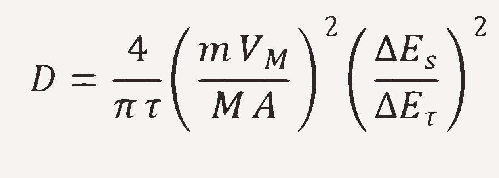

# GITT (Galvanostatic Intermittent Titration Technique)

## Introduction
The performance of metal-ion batteries is highly bounded to metal ions' diffusion coefficients, as these coefficients dictate the rate at which ions migrate through the electrolyte and electrode materials. This, in turn, influences charge and discharge rates, energy density, and overall battery efficiency.

Galvanostatic Intermittent Titration Technique (GITT) is considered a useful procedure to obtain either thermodynamic or kinetic parameters, such as the diffusion coefficient. By applying controlled current pulses followed by relaxation periods, this technique allows the determination of ion transport properties and equilibrium potentials, which are crucial for optimizing battery design and performance.

## Formula
The chemical diffusion coefficient at each step is calculated using the following formula:

  

- **ΔEs**: Steady-state voltage change after the discharge/charge pulse  
- **ΔEτ**: Voltage variation during the discharge/charge pulse  
- **m**: Mass of the active material  
- **M**: Molecular mass of the active material  
- **Vm**: Molar volume of the active material  
- **A**: Surface area of the electrode
- **τ**: Duration of the pulse

The above formula is derived using Fick's First Law of diffusion. A detailed derivation is available in the [Derivation-LaTeX](Derivation-LaTeX) folder.
GITT experiments are performed by applying a series of controlled current pulses, each followed by a relaxation period during which the cell voltage stabilizes. Key experimental points include:

- **Pulse Control:** Ensuring that each pulse of duration **τ** is short enough to maintain a near-linear voltage response, yet long enough to perturb the system measurably.
- **Relaxation Period:** Allowing sufficient time for the cell to reach a quasi-equilibrium state, ensuring that the measured **ΔEs** accurately represents the steady-state condition.
- **Assumptions:** It is assumed that the system behavior is governed by Fickian diffusion and that the relaxation period allows the electrode to reach equilibrium. Deviations can occur under non-ideal conditions.

There is also a diffusion coefficient calculator in [DiffCoefficientCalculator](DiffCoefficientCalculator) folder.

## Features
- **User-friendly GUI**
- **Excel file support**
- **Graphical visualization**
- **Data export** 

## How to Use
1. Select the Excel file containing `es` and `etau` columns.
2. Input necessary parameters (sample mass, molar volume, molar mass, electrode area, pulse duration).
3. Click **Run Analysis!** to process data.

- Ensure input data contains the required two columns (`es`, `etau`).

## Requirements
- Python 3.x
- `tkinter`, `pandas`, `numpy`, `matplotlib`
